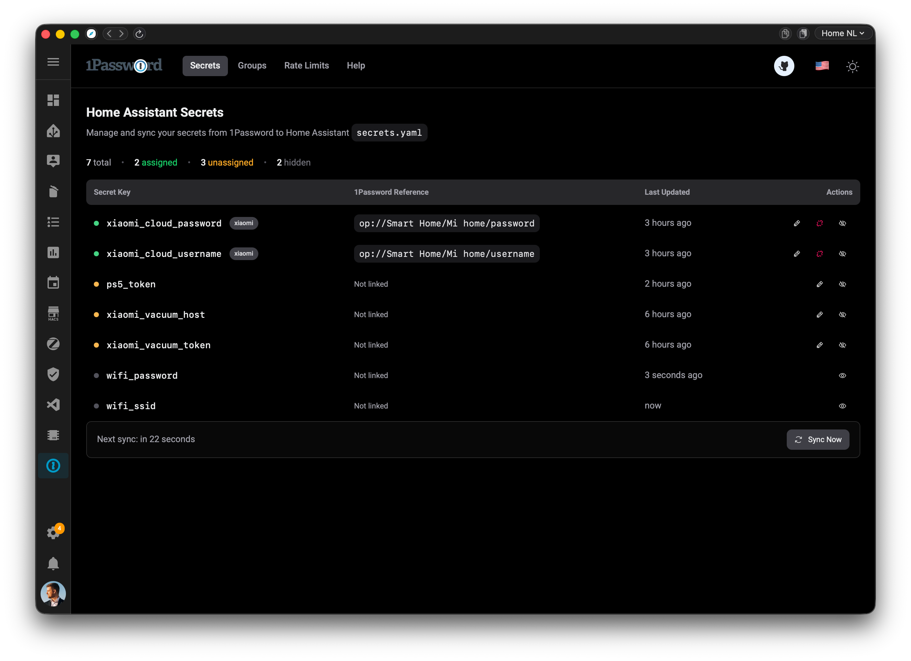
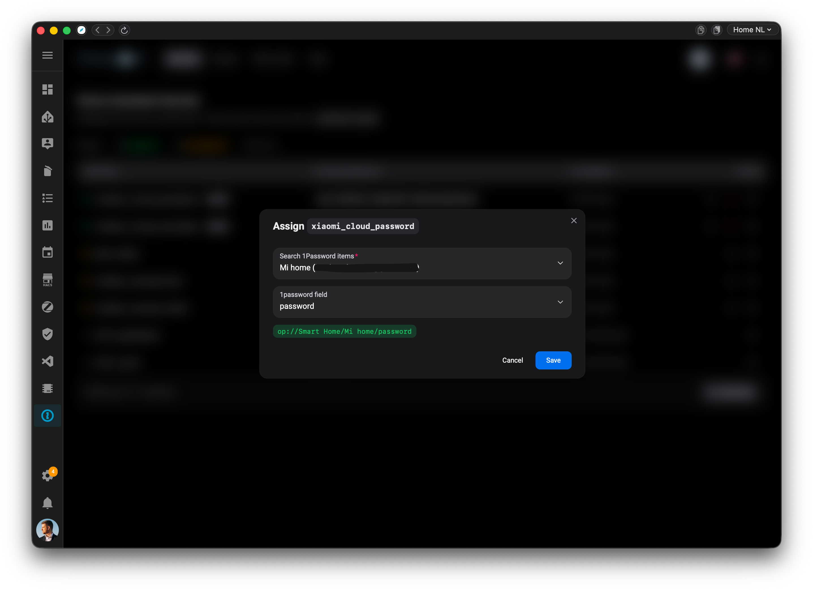
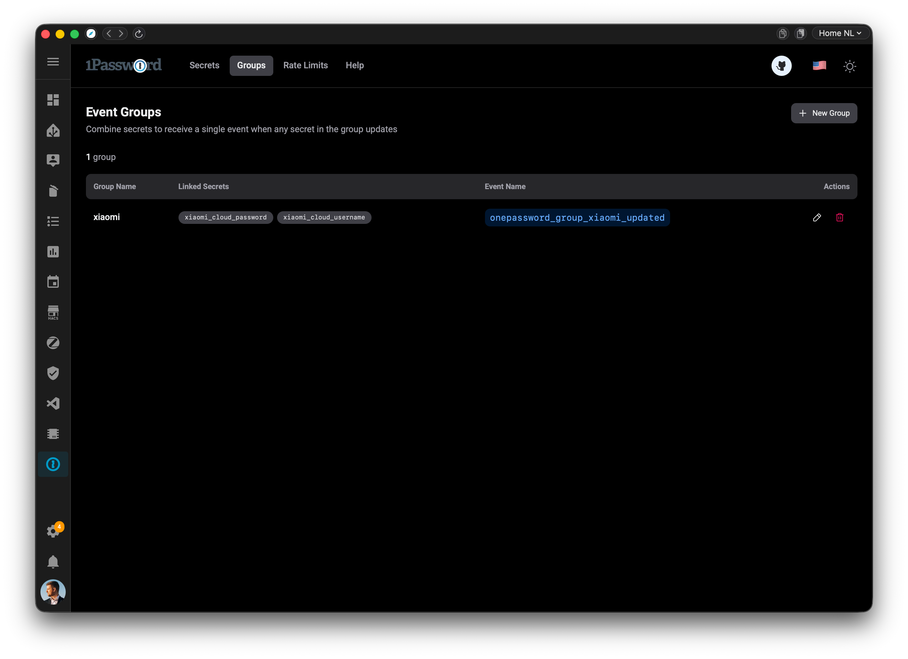
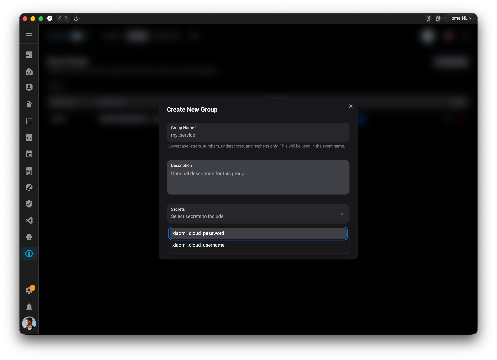
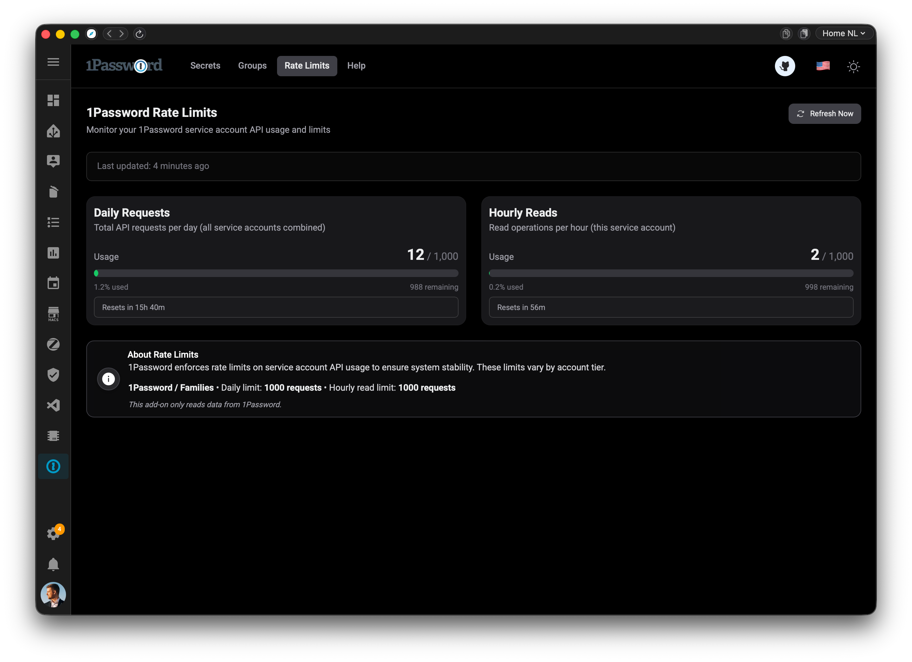
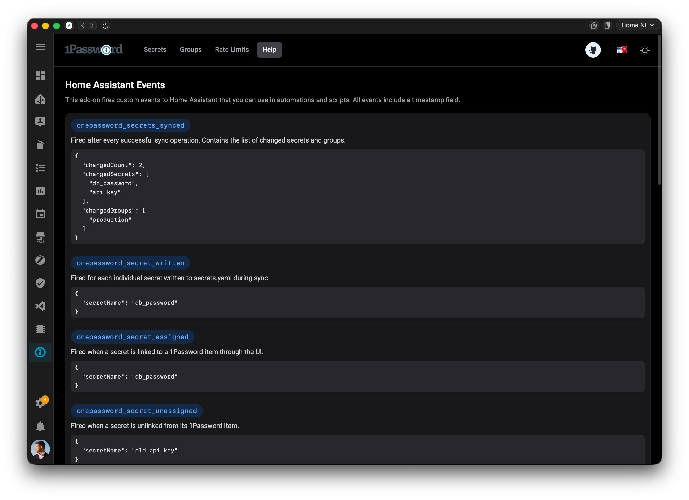

# Home Assistant App: 1Password Secrets Storage

![Supports aarch64 Architecture][aarch64-shield]
![Supports amd64 Architecture][amd64-shield]
![Version][version-shield]
![License][license-shield]

[aarch64-shield]: https://img.shields.io/badge/aarch64-yes-green.svg
[amd64-shield]: https://img.shields.io/badge/amd64-yes-green.svg
[version-shield]: https://img.shields.io/badge/version-0.2.0-blue.svg
[license-shield]: https://img.shields.io/github/license/Borales/hassio-addons.svg

## About

The **1Password Secrets Storage** app seamlessly integrates 1Password with Home Assistant, enabling automatic synchronization of your secrets from 1Password vaults directly into your Home Assistant `secrets.yaml` file. Say goodbye to manually managing sensitive credentials and embrace secure, automated secret management!

This app provides a modern web interface accessible through Home Assistant, allowing you to:

- 🔄 Automatically sync secrets from 1Password to Home Assistant
- 🗂️ Organize secrets into groups for easy management
- 📊 Monitor 1Password service account rate limits
- 🔍 Track secret assignments and sync status
- 🎯 Selectively sync only the secrets you need

## Features

✨ **Key Features:**

- **Automatic Secret Synchronization**: Sync secrets from your 1Password vaults to Home Assistant's `secrets.yaml` on a configurable schedule
- **Service Account Integration**: Uses 1Password service accounts for secure, automated access
- **Web-Based Management UI**: Modern, intuitive interface
- **Rate Limit Monitoring**: Track your 1Password API usage to stay within daily limits
- **Group Management**: Organize secrets into groups for better organization and event notifications
- **Real-Time Event System**: Receives Home Assistant events when secrets are synced or updated
- **Multi-Vault Support**: Access secrets from multiple 1Password vaults
- **Selective Sync**: Choose which secrets to sync and skip unnecessary ones
- **Configuration Scanning**: Automatically detects `!secret` references in your Home Assistant configuration
- **Multi-Language Support**: Available in English (GB, US), German, Dutch, Polish, and Ukrainian (so far!)

## How It Works

### Secure Secret Storage

The app uses a **secure, privacy-focused approach** to handling your 1Password secrets:

1. **Masked Storage**: The SQLite database stores 1Password secrets as **masked values** only, showing just the first and last few characters (e.g., `ab••••••xy`). Full secret values (with "CONCEAL" type) are **never** stored in the database raw.

2. **On-Demand Fetching**: When 1Password items are detected as changed during sync, the app:
   - Fetches the **actual secret values** directly from 1Password
   - Writes them immediately to Home Assistant's `secrets.yaml`
   - Continues storing only masked values in the database

3. **Sync Process**:
   ```
   1Password → [Masked DB Storage] → Detect Changes → Fetch Full Value → secrets.yaml
   ```

This approach ensures that even if someone gains access to the app's database, they won't have access to your actual secret values—only masked representations for tracking and assignment purposes.

## Screenshots

### Main Dashboard

See all your Home Assistant secrets and their 1Password assignments at a glance.



### Assign Secrets to 1Password Items

Link your Home Assistant secrets to 1Password items with an easy-to-use interface.



### Group Management

Create and manage secret groups for organized event notifications.





### Rate Limits Monitoring

Monitor your 1Password service account API usage and daily limits.



### Help & Documentation

Built-in help section with guidance on using the app effectively.



## Installation

### Prerequisites

Before installing this app, you'll need:

1. **A 1Password account** with a Business or Enterprise plan (for service account access)
2. **A 1Password service account token** - [create one here](https://developer.1password.com/docs/service-accounts/get-started/)
3. **Home Assistant OS** or Supervised installation

### Step 1: Add the Repository

1. Navigate to **Settings** → **Apps** → **Install App** in your Home Assistant interface
2. Click the **three-dot menu** (⋮) in the top-right corner
3. Select **Repositories**
4. Add the following repository URL: `https://github.com/Borales/hassio-addons`
5. Click **Add** and then **Close**

### Step 2: Install the App

1. Refresh the App Store page (you may need to hard-refresh: Ctrl+F5 or Cmd+Shift+R)
2. Scroll down to find **"1Password Secrets Storage"** in the list
3. Click on the app, then click **Install**
4. Wait for the installation to complete (this may take a few minutes)

### Step 3: Configure the App

1. Once installed, go to the **Configuration** tab
2. Enter your **1Password Service Account Token**: `"ops_xxxxxxxxxxxxxxxxxxxxxxxxxxxxxxxx"`
3. (Optional) Adjust the **check interval** and **log level** as needed
4. Click **Save**

### Step 4: Start the App

1. Go to the **Info** tab
2. Click **Start**
3. Optionally enable **"Start on boot"** and **"Watchdog"** for automatic restart
4. Click **"Show in sidebar"** to add quick access to the app UI

### Step 5: Access the Web Interface

1. Click on **"1password"** in the Home Assistant sidebar (or open it from the app page)
2. The web interface will open, showing your Home Assistant secrets
3. Start assigning secrets to your 1Password items!

## Configuration

The app can be configured through the **Configuration** tab in the app interface.

### Configuration Options

| Option                | Type     | Required | Default | Description                                               |
| --------------------- | -------- | -------- | ------- | --------------------------------------------------------- |
| `serviceAccountToken` | password | Yes      | -       | Your 1Password service account token (starts with `ops_`) |
| `checkIntervalMin`    | int      | No       | `10`    | Interval in minutes between automatic sync checks (0-180) |
| `logLevel`            | list     | No       | `info`  | Logging level: `debug`, `info`, or `error`                |

### Example Configuration

```yaml
serviceAccountToken: "ops_xxxxxxxxxxxxxxxxxxxxxxxxxxxxxxxx"
checkIntervalMin: 15
logLevel: "info"
```

### Configuration Notes

- **Service Account Token**: Must be a valid 1Password service account token. Keep this secure! Service accounts need read access to the vaults containing your secrets.
- **Check Interval**: Setting this too low may cause you to hit 1Password's daily rate limits. See the Rate Limits section below for more information.
- **Log Level**: Use `debug` for troubleshooting, `info` for normal operation, and `error` to minimize logging.

## Usage

### First-Time Setup

1. **Scan Your Configuration**: The app automatically scans your Home Assistant configuration for `!secret` references
2. **Assign Secrets**: Use the web interface to assign each secret to a corresponding 1Password item
3. **Sync**: The app will automatically sync assigned secrets based on your configured interval

### Assigning Secrets

1. Open the app web interface from the Home Assistant sidebar
2. Find a secret you want to sync from 1Password
3. Click the **"Assign"** button next to the secret
4. Select the **1password items** (you can start typing to search)
5. Choose the **1password field** from the item to sync
6. Click **"Assign"** to confirm

### Creating Secret Groups

Groups allow you to organize secrets and receive Home Assistant events when specific secrets are updated:

1. Navigate to the **"Groups"** page in the app interface
2. Click **"New Group"**
3. Enter a group name and description
4. Select the secrets to include in the group
5. Save the group

When any secret in a group is synced, a `onepassword_group_{name}_updated` event will be fired in Home Assistant.

### Monitoring Rate Limits

1Password service accounts have daily API request limits that vary by plan:

- **Starter/Team**: 1,000 requests/day
- **Business**: 5,000 requests/day
- **Enterprise**: 50,000 requests/day

View your current usage on the **Rate Limits** page to ensure you stay within your daily quota. If you approach the limit, consider increasing the `checkIntervalMin` value or reducing the number of synced secrets.

### Home Assistant Events

The app fires custom Home Assistant events that you can use in automations:

- `onepassword_secrets_synced` - Fired when a batch sync completes
- `onepassword_secret_written` - Fired when a secret is written to `secrets.yaml`
- `onepassword_secret_assigned` - Fired when a secret is linked to 1Password
- `onepassword_secret_unassigned` - Fired when a secret assignment is removed
- `onepassword_group_{name}_updated` - Fired when secrets in a group are synced
- `onepassword_error` - Fired when an error occurs

#### Example automations

Restarting an Add-on via Secret Event:

```yaml
alias: "Update PS5 Token and Restart App"
description: "Restarts the PS5 MQTT add-on when its secret is updated"
mode: single

trigger:
  - platform: event
    event_type: "onepassword_secret_written"

condition:
  - condition: template
    value_template: "{{ trigger.event.data.secretName == 'ps5_token' }}"

action:
  - service: hassio.addon_restart
    data:
      addon: "df2164f9_ps5_mqtt"
```

Notification for Xiaomi Integration Update:

```yaml
alias: "Notify for Xiaomi Secret Update"
description: "Prompts a manual restart when Xiaomi Cloud Map Extractor secrets are updated"
mode: single

trigger:
  - platform: event
    event_type: "onepassword_group_xiaomi_updated"

action:
  - service: notify.persistent_notification
    data:
      title: "Xiaomi Cloud Map Extractor Secrets Updated"
      message: "New Xiaomi Cloud Map Extractor secrets have been detected. Please restart Home Assistant to apply these changes to the integration."
      notification_id: "xiaomi_restart_needed"
```

## Important Information

### Rate Limits

⚠️ **Important**: 1Password service accounts have daily rate limits that vary by plan type. Each API request counts toward your daily limit, including:

- Fetching vault lists
- Reading item details
- Checking for updates

**Recommendations:**

- Start with a `checkIntervalMin` of 10-15 minutes
- Monitor your usage on the Rate Limits page
- Adjust the interval if you approach your daily limit
- Consider which secrets truly need automatic syncing

More details on rate limits: [1Password Service Account Rate Limits](https://developer.1password.com/docs/service-accounts/rate-limits#daily-limits)

### Security Considerations

- **Service Account Token**: Store your service account token securely. It provides read access to all vaults the service account can access.
- **Database Storage**: The app's SQLite database stores only **masked versions** of secrets (first and last few characters visible). Full secret values are never persisted in the database - they're fetched on-demand from 1Password and written directly to `secrets.yaml`.
- **Secrets File**: The app writes full secret values to `/config/secrets.yaml` only. Ensure your Home Assistant configuration is properly secured with appropriate file permissions and backups.
- **Access Control**: Use Home Assistant's built-in authentication and authorization features to control who can access the app interface.
- **Data Flow**: Actual secret values flow from 1Password → secrets.yaml without being stored in the app's database, minimizing exposure points.

### Backup Recommendations

Before using this app:

1. **Backup your existing `secrets.yaml`** file
2. Test the app with a few non-critical secrets first
3. Verify synced secrets work correctly in your configuration
4. Set up regular Home Assistant backups

## Support

If you encounter issues or have questions:

- **Documentation**: Check the [DOCS.md](DOCS.md) file for additional information
- **Issues**: Report bugs or request features on [GitHub Issues](https://github.com/Borales/hassio-addons/issues)
- **Changelog**: See [CHANGELOG.md](CHANGELOG.md) for version history and updates
- **Home Assistant Community**: Visit the [Home Assistant Community Forum](https://community.home-assistant.io/)

### Common Issues

**App won't start**

- Verify your service account token is correct
- Check the app logs for error messages
- Ensure Home Assistant can access the internet

**Secrets not syncing**

- Verify secrets are properly assigned in the web interface
- Check that the service account has read access to the selected vaults
- Monitor rate limits to ensure you haven't exceeded your daily quota

**Rate limit errors**

- Increase the `checkIntervalMin` value
- Remove unnecessary secret assignments
- Consider upgrading your 1Password plan for higher limits

## Contributing

Contributions are welcome! If you'd like to contribute:

1. Fork the repository
2. Create a feature branch
3. Make your changes
4. Submit a pull request

Please ensure your code follows the existing patterns and includes appropriate documentation.

## Support the Project

If you find this app helpful and want to support its development, consider buying me a coffee! ☕

[](https://buymeacoffee.com/borales)
[](https://ko-fi.com/borales_gh)

Your support helps maintain and improve this project!

## License

This project is licensed under the [MIT License](https://github.com/Borales/hassio-addons/blob/main/LICENSE).

## Acknowledgments

- Built with [Next.js 16](https://nextjs.org/)
- Uses the [1Password Service Accounts](https://developer.1password.com/docs/service-accounts/) API
- UI components from [HeroUI](https://heroui.com/)
- Powered by [Home Assistant](https://www.home-assistant.io/)

## Links

- **GitHub Repository**: [https://github.com/Borales/hassio-addons](https://github.com/Borales/hassio-addons)
- **Issue Tracker**: [https://github.com/Borales/hassio-addons/issues](https://github.com/Borales/hassio-addons/issues)
- **1Password Developer Documentation**: [https://developer.1password.com/](https://developer.1password.com/)
